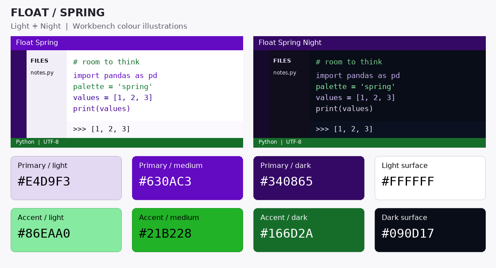
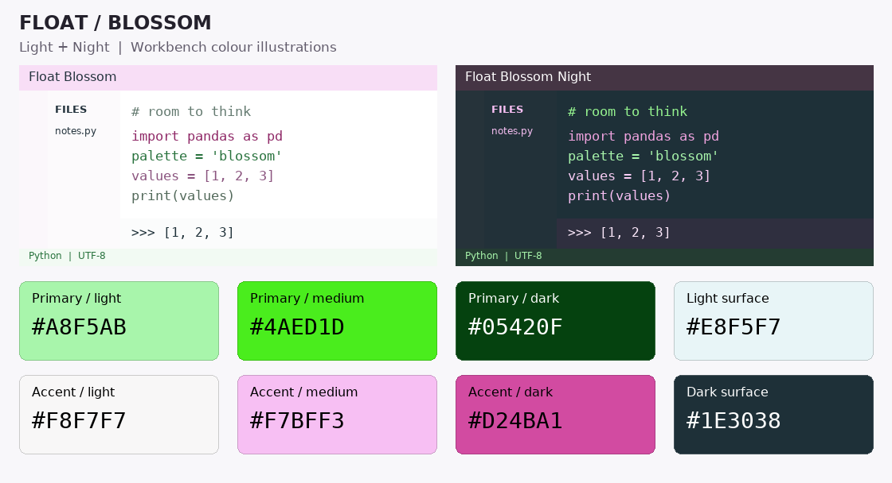
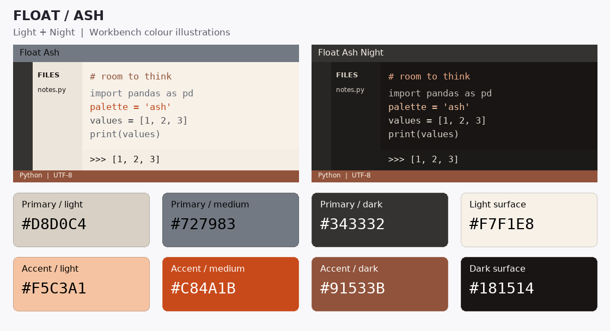
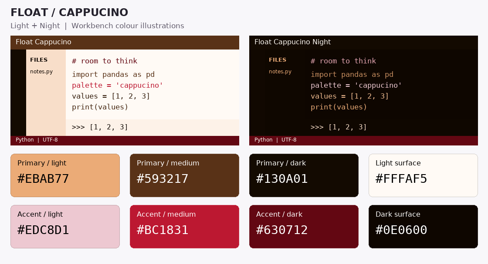
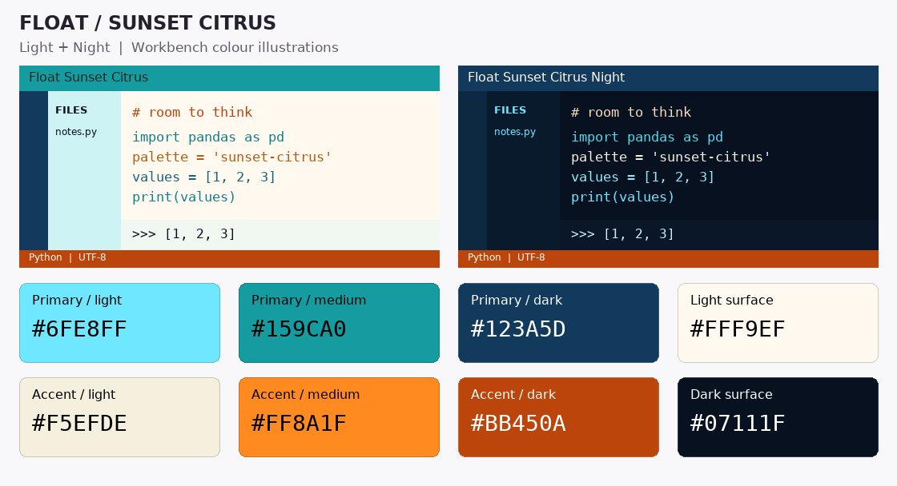
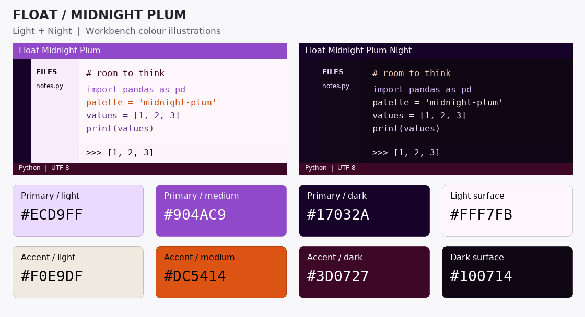

# Float Themes for Positron

All six built-in Float palettes, with a light and a **Night** version of each: **12 themes** for Positron.

Colours carry through the editor, terminal, Console, Variables, Data Explorer, Plots, Packages, notebooks, dialogs, and selection states. Every theme includes TextMate syntax and semantic-token highlighting.

## Install

1. Download **[float-positron-themes-0.2.1.vsix](https://github.com/firecat1234/positron-float-themes/releases/download/v0.2.1/float-positron-themes-0.2.1.vsix)** from the [latest release](https://github.com/firecat1234/positron-float-themes/releases/latest).
2. In Positron's Command Palette, run **Extensions: Install from VSIX...** and choose the file.
3. Run **Preferences: Color Theme** and choose a **Float** theme.

Or install from a terminal:

```powershell
positron --install-extension .\float-positron-themes-0.2.1.vsix
```

Already using Float Spring? Install this VSIX to upgrade. The extension keeps its original internal ID, `kaist-local.float-spring-positron-theme`, so you do not get a second copy. **Float Spring** and **Float Spring Night** retain their existing names and colours.

## Palettes

Each card shows light and Night workbench **illustrations**, followed by the eight original Float colour slots. Hex values sit directly on the colour they describe. The workbench uses derived shades where needed for surfaces and readable text; swatches are the exact source values.

### Spring

Lavender and purple with mint and pear-green accents. Choose **Float Spring** or **Float Spring Night**.



### Blossom

White work surfaces, a pale pink title bar, and green details, matching Blossom as rendered in Float. Its Night version uses slate surfaces with a muted pink header. Choose **Float Blossom** or **Float Blossom Night**.



### Ash

Oat and charcoal neutrals with ember-orange accents. Choose **Float Ash** or **Float Ash Night**.



### Cappucino

Warm espresso and cream with cherry-red accents. Choose **Float Cappucino** or **Float Cappucino Night**. The name follows Float's original spelling.



### Sunset Citrus

Twilight teal and deep blue with a citrus-orange flare. Choose **Float Sunset Citrus** or **Float Sunset Citrus Night**.



### Midnight Plum

Plum and lavender with warm ivory and burnt-orange accents. Choose **Float Midnight Plum** or **Float Midnight Plum Night**.



## Source palettes and builds

The palette snapshot in [CX_palettes.json](CX_palettes.json) contains the exact eight-slot definitions from Float's built-in themes as of September 22, 2026, plus their source filenames. Hex values are also available there as copyable text.

The original Spring JSON files are retained as the shared workbench templates. The build script maps their surface roles to the other palettes, preserves diagnostic colours, and adjusts new-theme foregrounds to at least 4.5:1 contrast against their checked surfaces. This check covers theme colours, not every possible extension or embedded plot.

With Python 3.10+ and Node.js installed:

```powershell
python scripts/CX_build_themes.py
python scripts/CX_check_themes.py
npx --yes @vscode/vsce package --out float-positron-themes-0.2.1.vsix
```

To regenerate the colour cards, install Pillow and run:

```powershell
python -m pip install Pillow
python scripts/CX_build_themes.py --cards
```

Cards use DejaVu Sans where available, or Segoe UI and Consolas on Windows. They are PNGs so the coloured backgrounds work in both GitHub's README and the packaged extension documentation.

The `.vsix` is attached to GitHub releases rather than committed to the source tree. This is a theme-only extension; it contains no runtime code.
